##  Windows 系统下安装 IntelliJ IDEA

### 本套教程所用工具版本说明
> * Intellij IDEA 的版本：`ideaIU-14.1.4`
> * JDK版本：`jdk-7u80-windows-x64`
> * Maven：`apache-maven-3.0.5`
> * Gradle：` gradle-2.3`
> * Tomcat：`apache-tomcat-7.0.62`

### 官方系统配置要求
> *  Microsoft Windows 8/7/Vista/2003/XP (incl.64-bit)
> *  1 GB RAM minimum, 2 GB RAM recommended
> *  300 MB hard disk space + at least 1 G for caches
> *  1024x768 minimum screen resolution
> *  JDK 1.6 or higher

### 系统环境变量配置要求
> *  配置JAVA_HOME的环境变量(`JDK 1.6` 以上)
> *  构建Maven 项目，请先配置Maven的环境变量(`可选`，Intellij 14 以上版本自带 maven 3 和 maven 2 版本)
> *  构建Gradle 项目，请先配置Gradle 的环境变量(具体操作百度)

### 官方下载地址
> *  Intellij IDEA:  <https://confluence.jetbrains.com/display/IntelliJIDEA/Previous+IntelliJ+IDEA+Releases>
> *  JDK 1.6 :  <http://www.oracle.com/technetwork/java/javasebusiness/downloads/java-archive-downloads-javase6-419409.html#jdk-6u21-oth-JPR>
> *  JDK 1.7 :  <http://www.oracle.com/technetwork/java/javase/downloads/jdk7-downloads-1880260.html>
> *  JDK 1.8 :  <http://www.oracle.com/technetwork/java/javase/downloads/index.html>
> *  Maven   : <http://maven.apache.org/download.cgi>
> *  Gradle  :  <http://gradle.org/gradle-download/>

### 首次安装
> *   Intellij IDEA 安装速度很快，非常简单。基本都是默认下一步即可，如有不同，会有特殊说明。

#### 第1步
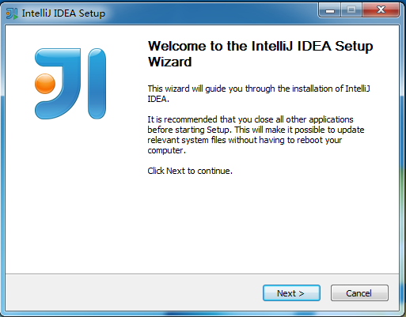
#### 第2步
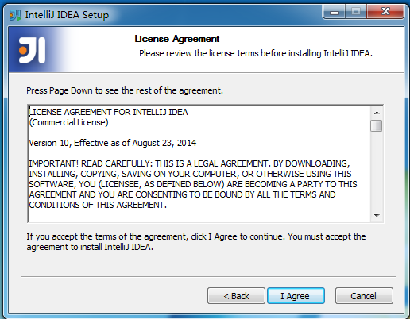
#### 第3步
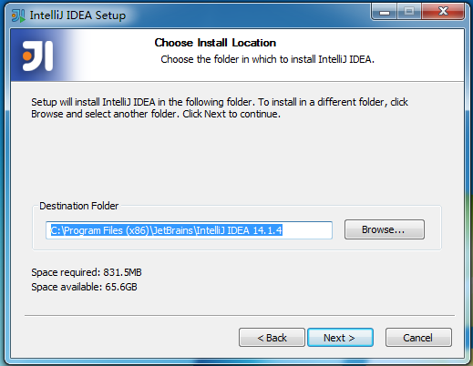
#### 第4步
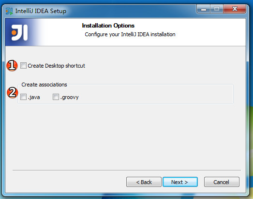
> *  编号1：勾选，表示创建桌面快捷方式。
> *  编号2：勾选后表示默认打开java文件和groovy使用Intellij IDEA 打开，建议不勾选。

####  第5步
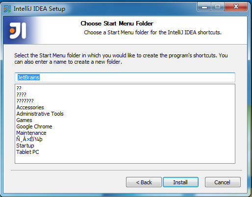

####  第6步
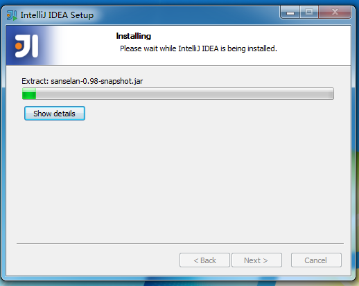

####  第7步
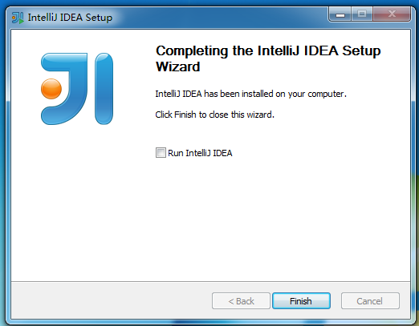
> *  安装成功，点击`Fish`立即启动

### 首次启动

#### 启动画面

#### 第1步
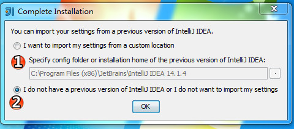
> * 进入Intellij IDEA 软件的配置文件的选择目录.
1.新安装的话，是没有这个配置文件的。直接选择'OK'
2.第二次安装，如果想使用以前Intellij IDEA 的配置文件，请选择①
> * 这个配置文件默认生成的目录：C:\Users\ `计算机用户名`\\.IntelliJIdea14

#### 第2步
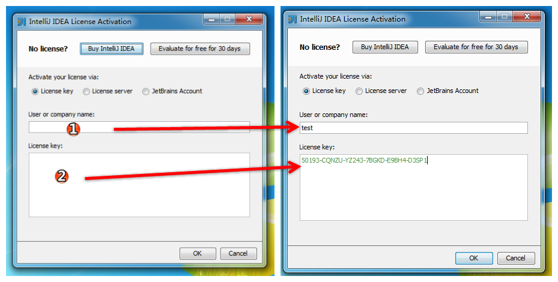
> * 输入秘钥。
> * 下载注册机
> * 搜索在线注册的网站
> * 加入QQ群：，看群公告获取.
> * `注：以上破解Intellij IDEA 的方式,仅供个人开发学习使用，请求支持正版`
> * [购买正版地址](https://www.jetbrains.com/idea/download/)

#### 第3步
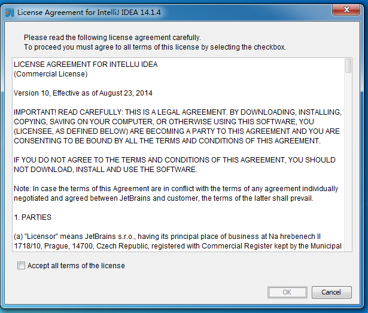
#### 第4步
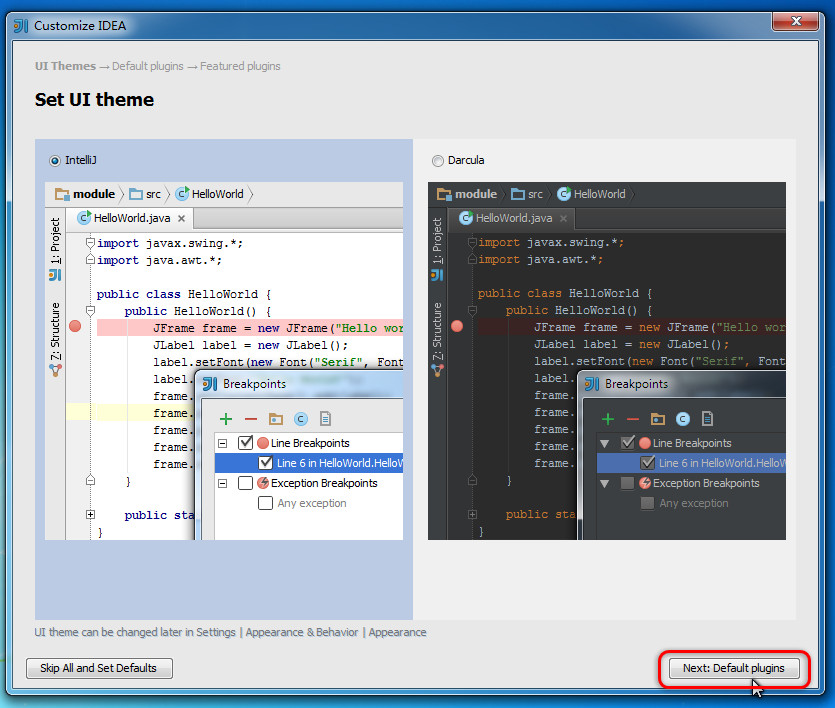
#### 第5步
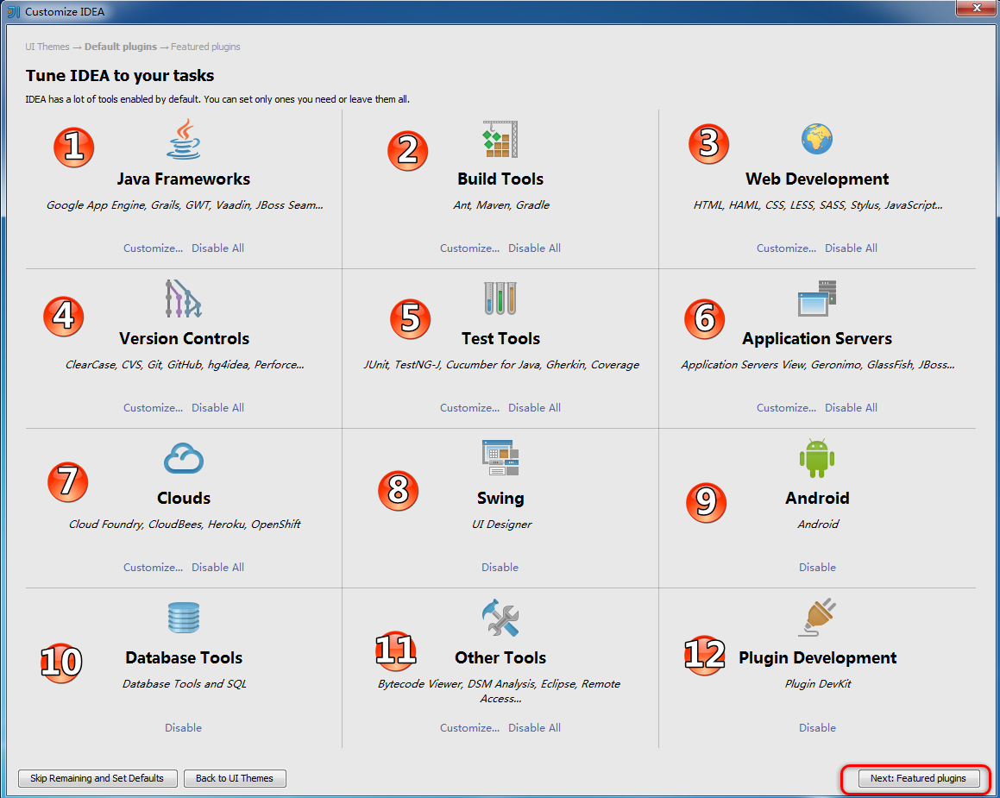

> ##### 编号1
>  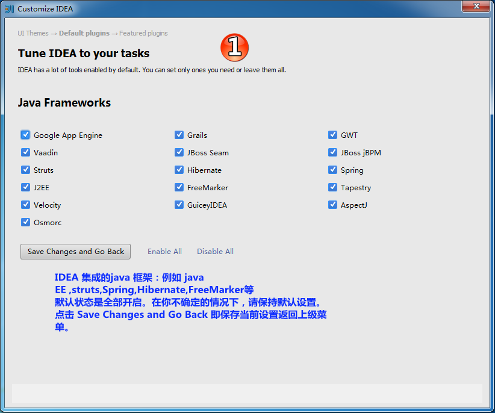
> ##### 编号2
>  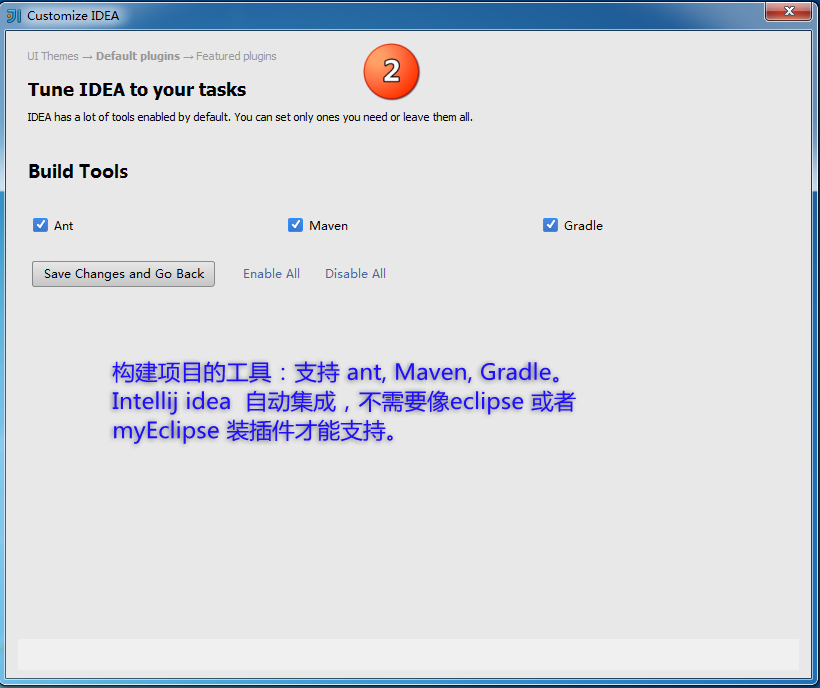
> ##### 编号3
>  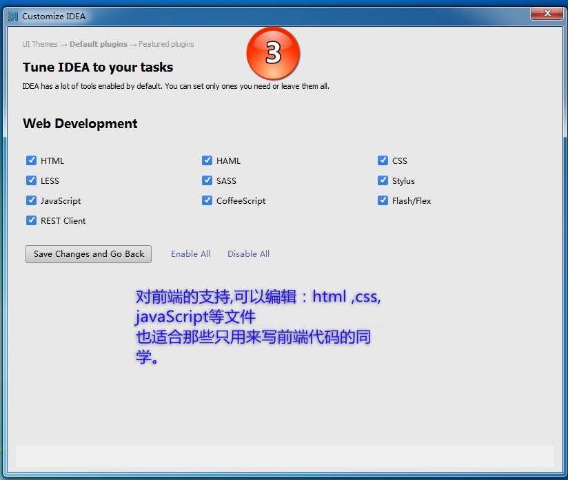
> ##### 编号4
>  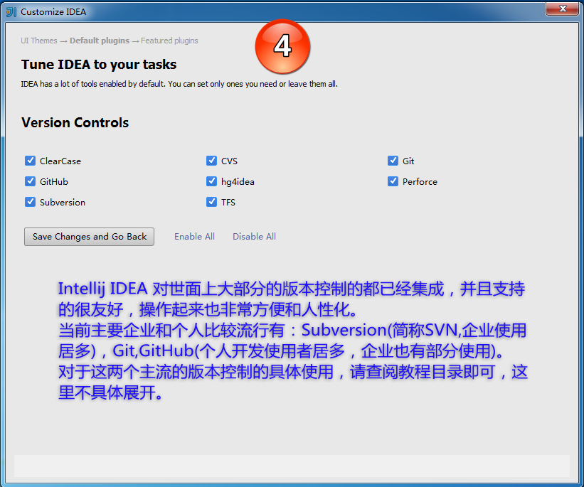
> ##### 编号5
>  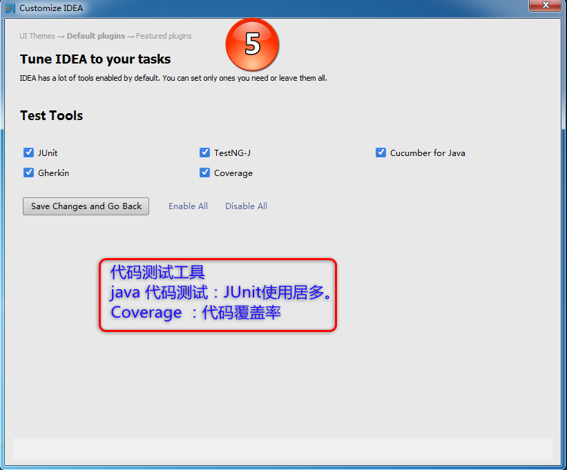
> ##### 编号6
>  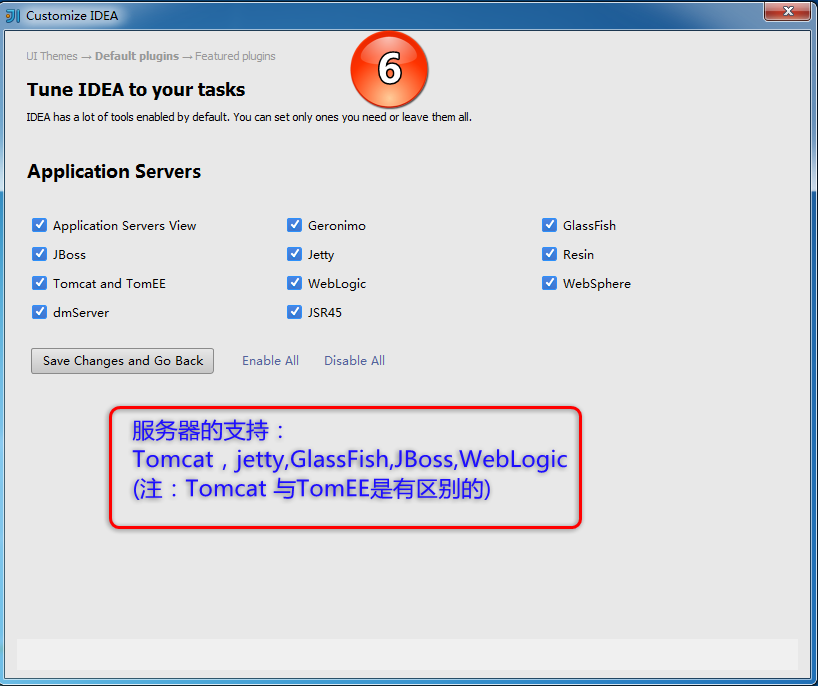
> ##### 编号7
>  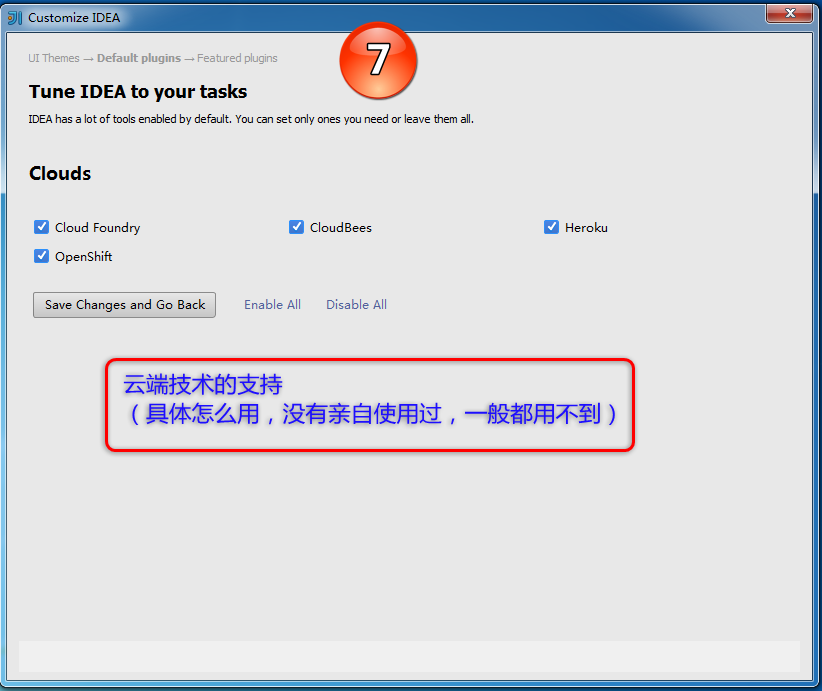
> ##### 编号11
>  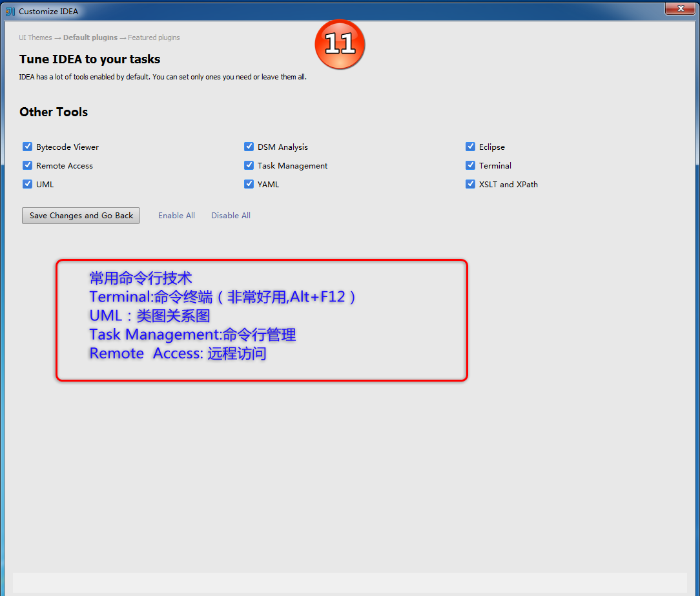
#### 第6步
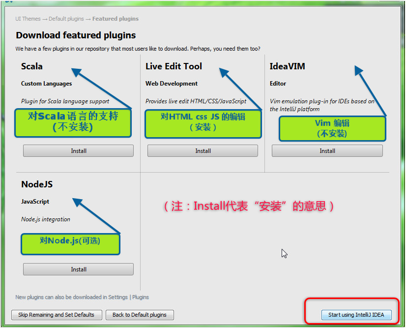
#### 第7步
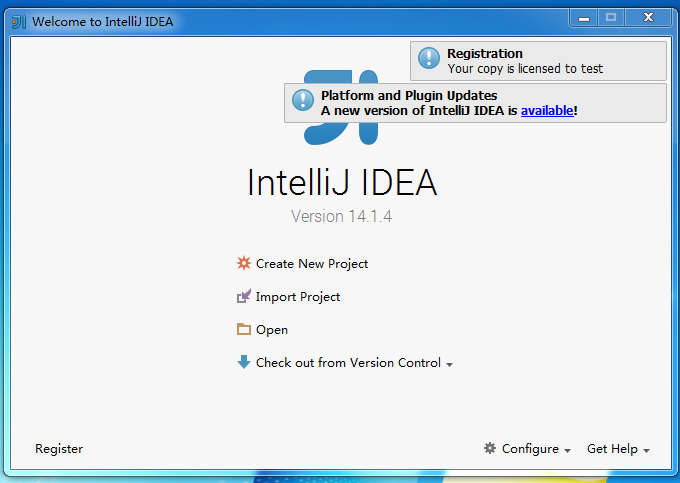

## 已有旧版本安装新版本

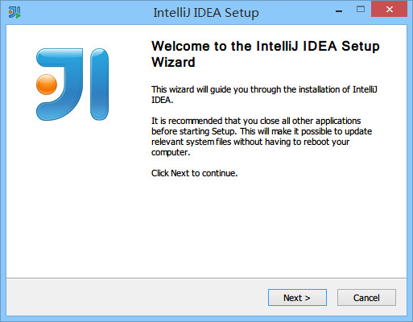

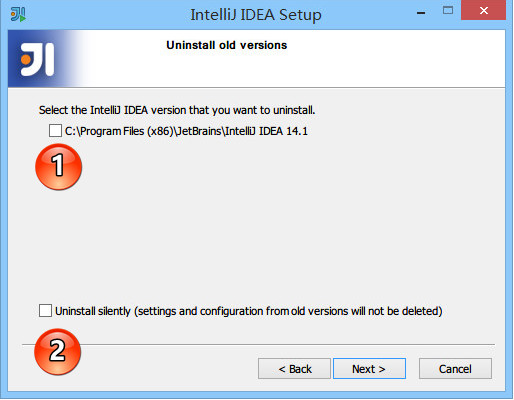

> * 上图，显示我目前电脑中已经有一个 IntelliJ IDEA 版本，如果我勾选了标记 1，则表示安装之前会先卸载掉电脑上的旧版本。
> * 上图标记 2，如果勾选了，则 IntelliJ IDEA 在卸载旧版本的时候直接删除掉你旧版本的个性化设置，`（慎重勾选）`。
> * IntelliJ IDEA 是支持一台电脑装多个大版本的。比如可以同时装` Intellij IDEA 13 系列的版本`和`Intellij IDEA 14 系列的版本`。
> * 接下来的步骤我们假设勾选了标记  1 再进行安装。

> * 上图，由于上一步勾选了卸载旧版本选项，所以出现了选择删除旧版本的配置选项。
> * 第一个选项：删除旧版本的缓存和本地历史记录。`（慎重勾选）`
> * 第二个选项：删除旧版本的个人个性化设置。`（慎重勾选）`
> * 点击 uninstall，进入全自动的卸载过程，卸载完成接下来的步骤跟上文`首次安装`一致，这里不再进行说明。

## 卸载

> * 卸载过程完整截图

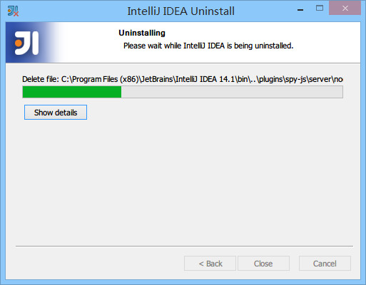

